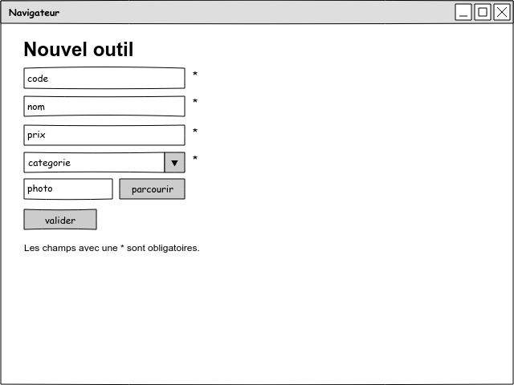

# CNAM PHP Basic

## Contrôle continu décembre 2018

Voici deux pages en wireframe (en fil de fer) du projet à réaliser :

La première page a été réalisée en cours.

Votre tâche est de réaliser la deuxième page.

### Contraintes techniques

La deuxième page sera nommée `new-sub-category.php`.

Les variables devront être nommées en anglais mais les labels ou les placeholders des champs seront nommés en français (comme en cours).

Elle devra être scindée en deux parties :

1. la patrie contrôleur, dans le dossier `public`
2. la partie vue, dans le dossier `templates`

Le contrôleur doit :

- défnir des valeurs de données par défaut
- valider les données utilisateur
- afficher la vue

Inspirez-vous de ce qui a été fait en cours (fichiers `public/new-tool.php` et `templates/new-tool.php`) pour créer le code de la deuxième page.

### Analyse

Pour vous aider à mieux cerner le problème voici une analyse des données.

#### Analyse de la page `new-tool`

| champ     | name     | type                       | balise                | obligatoire |
| --------- | -------- | -------------------------- | --------------------- | ----------- |
| code      | code     | chaîne de caractère        | input type text       | oui         |
| nom       | name     | chaîne de caractère        | input type text       | oui         |
| prix      | price    | nombre à virgule flottante | input type text       | oui         |
| catégorie | category | nombre entier              | select à choix unique | oui         |
| photo     | photo    | fichier                    | input type file       | non         |

#### Analyse de la page `new-sub-category`

| champ       | name        | type                       | balise                | obligatoire |
| ----------- | ----------- | -------------------------- | --------------------- | ----------- |
| catégorie   | category    | nombre entier              | select à choix unique | oui         |
| nom         | name        | chaîne de caractère        | input type text       | oui         |
| description | description | chaîne de caractère        | textarea              | non         |

### Livraison

Ce travail est à livrer le vendredi 21/12/2018 à 24h00 au plus tard.
Pour les retardataires, un délai supplémentaire jusque dimanche 23/12/2018 à 24h00 sera toléré, mais je serai beaucoup plus exigeant sur la qualité du travail.
Autrement dit, si vous livrez en retard, le travail doit être impécable.

La livraison doit être faite sous la forme d'un fichier zip contenant le dossier du projet.

Vous devez déposer le fichier sur mon espace SFTP.
Si vous n'y parvenez pas, en dernier recours, envoyez-le-moi par mail.

### Critères d'évaluation

- respect des consignes : structure du dossier projet, nom des pages, nom des champs, fonctionnalités
- code style : lisibilité, indentation, nommage des variables, lignes vides, espaces après ou avant mot-clés
- absence de bug (HTML et PHP)

